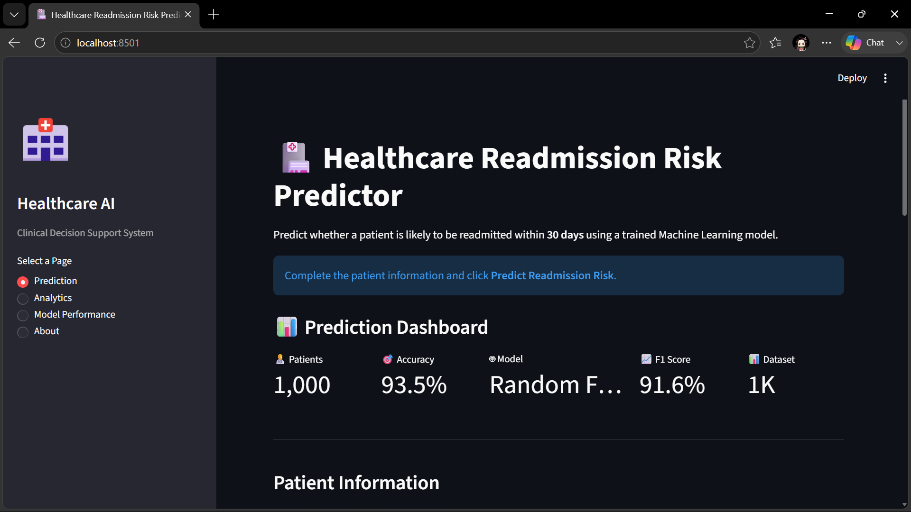
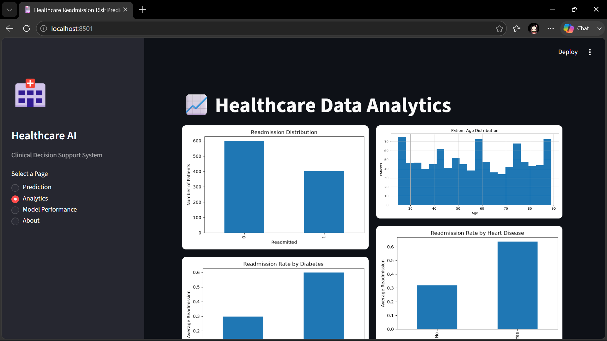
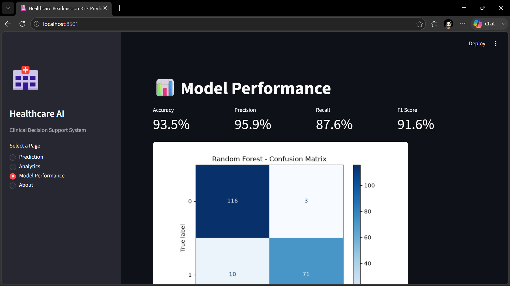
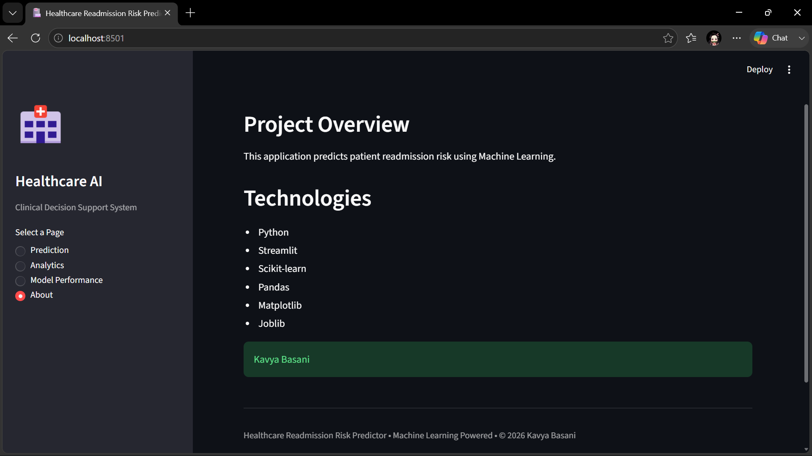

# 🩺 Healthcare Readmission Risk Predictor

A Machine Learning-powered web application that predicts whether a patient is likely to be readmitted within 30 days after hospital discharge. The application leverages a Random Forest classifier and provides an interactive Streamlit dashboard for healthcare analytics and clinical decision support.

---

## 📌 Project Overview

Hospital readmissions are a major concern for healthcare providers because they increase medical costs and may indicate inadequate post-discharge care. This project uses patient clinical information to predict the likelihood of readmission and helps healthcare professionals identify high-risk patients for early intervention.

The application provides:

- 🏥 Readmission risk prediction
- 📊 Interactive healthcare analytics dashboard
- 📈 Model performance evaluation
- 🤖 Machine Learning-based clinical decision support

---

## ✨ Features

- Predict patient readmission risk
- Confidence score for predictions
- Clinical recommendations
- Interactive healthcare dashboard
- Readmission distribution analysis
- Patient age distribution
- Diabetes and heart disease analysis
- Model performance metrics
- Confusion Matrix visualization
- Feature Importance analysis
- Multi-page Streamlit application

---

## 🧠 Machine Learning Workflow

1. Generate healthcare dataset
2. Data preprocessing and cleaning
3. Encode categorical variables
4. Train-test split
5. Train multiple Machine Learning models
6. Compare model performance
7. Select the best-performing model
8. Save trained model using Joblib
9. Deploy using Streamlit

---

## 🤖 Machine Learning Models Evaluated

- Logistic Regression
- Decision Tree Classifier
- Random Forest Classifier ✅ (Selected)

Random Forest was selected because it achieved the highest overall performance across multiple evaluation metrics.

---

## 📊 Model Performance

| Metric    | Score     |
| --------- | --------- |
| Accuracy  | **93.5%** |
| Precision | **95.9%** |
| Recall    | **87.6%** |
| F1 Score  | **91.6%** |

---

## 📷 Application Screenshots

### 🏠 Prediction Dashboard



---

### 📈 Healthcare Analytics



---

### 📊 Model Performance



---

### ℹ️ About Page



---

## 🛠 Technologies Used

- Python
- Streamlit
- Pandas
- NumPy
- Scikit-learn
- Matplotlib
- Joblib

---

## 📂 Project Structure

```text
healthcare-readmission-risk-predictor/
│
├── app.py
├── train_model.py
├── create_dataset.py
├── preprocess.py
├── requirements.txt
├── README.md
│
├── data/
│   ├── healthcare_readmission.csv
│   └── processed_data.csv
│
├── models/
│   └── readmission_model.pkl
│
└── screenshots/
    ├── age_distribution.png
    ├── confusion_matrix.png
    ├── readmission_distribution.png
    └── feature_importance.png
```

---

## 🚀 Installation

Clone the repository

```bash
git clone https://github.com/kbasani11/healthcare-readmission-risk-predictor.git
```

Navigate to the project directory

```bash
cd healthcare-readmission-risk-predictor
```

Install dependencies

```bash
pip install -r requirements.txt
```

Run the application

```bash
streamlit run app.py
```

---

## 📈 Future Improvements

- Integrate real-world hospital datasets
- Add SHAP model explainability
- Generate downloadable patient reports
- Deploy on Streamlit Community Cloud
- Add user authentication
- Support multiple Machine Learning models
- Real-time Electronic Health Record (EHR) integration

---

## 👩‍💻 Author

**Kavya Basani**

Graduate Student | Data Analytics | Machine Learning | Data Science
